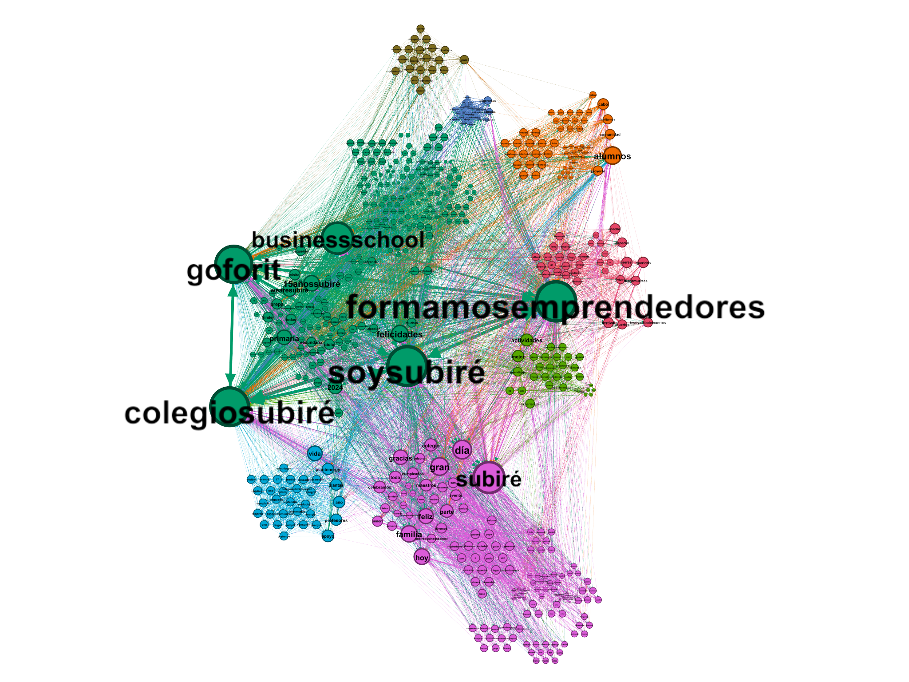

# ¿Qué es una netnografía?

La **Netnografía Digital** es una metodología de investigación que nos permite entender profundamente a nuestras audiencias observando y analizando sus conversaciones y comportamientos naturales en entornos online. Para Subiré Business School, proponemos un análisis netnográfico enfocado en las plataformas digitales donde sabemos que las conversaciones sobre educación, reputación escolar y decisiones familiares son más activas: **Facebook**, **Google Maps Reviews**, **Reddit**, **Twitter (X)** e **Instagram**.

En lugar de solo monitorear menciones, nos sumergiremos para entender el contexto, el sentimiento y las motivaciones detrás de lo que se dice.

## ¿Qué Información Específica Obtendremos de Cada Plataforma para Marketing?

<h3 style="font-size: 1.5rem; font-weight: bold; color: #06B6D4;">Facebook</h3>
<ul>
  <li><strong>Análisis:</strong> Grupos de recomendación de colegios en la ZMG, páginas oficiales de Subiré y competidores, análisis de publicaciones y comentarios.</li>
  <li><strong>Insights:</strong> Criterios de selección, patrones de recomendaciones, sentimiento y engagement, posicionamiento percibido.</li>
</ul>

<h3 style="font-size: 1.5rem; font-weight: bold; color: #06B6D4;">Google Maps Reviews</h3>
<ul>
  <li><strong>Análisis:</strong> Evaluación detallada de reseñas, calificaciones y respuestas en perfiles.</li>
  <li><strong>Insights:</strong> Evaluación integral de la experiencia del usuario, identificación de patrones en categorías clave.</li>
</ul>

<h3 style="font-size: 1.5rem; font-weight: bold; color: #06B6D4;">Reddit</h3>
<ul>
  <li><strong>Análisis:</strong> Subreddits locales y de educación, búsqueda de menciones sobre colegios.</li>
  <li><strong>Insights:</strong> Percepciones de valor, comparativas detalladas, preocupaciones y criterios de selección de padres locales.</li>
</ul>

<h3 style="font-size: 1.5rem; font-weight: bold; color: #06B6D4;">Twitter (X)</h3>
<ul>
  <li><strong>Análisis:</strong> Menciones directas, hashtags, conversaciones sobre noticias educativas locales.</li>
  <li><strong>Insights:</strong> Reputación comparativa en tiempo real, impacto de eventos, temas candentes en el sector educativo.</li>
</ul>

## Beneficios Clave para el Marketing de Subiré

  <h3 style="font-size: 1.5rem; font-weight: bold; color: #059669;">Inteligencia Competitiva Real</h3>
  

    La netnografía permite acceder a una visión mucho más <b>profunda y auténtica</b> del mercado educativo, yendo más allá de los discursos institucionales y la información oficial que comparten los competidores. A través del <b>análisis de conversaciones espontáneas, reseñas y debates en plataformas digitales</b>, es posible identificar <b>tendencias emergentes</b>, <b>necesidades no satisfechas</b>, <b>percepciones reales</b> sobre las fortalezas y debilidades de cada institución, y anticipar <b>movimientos estratégicos de la competencia</b>. Esta inteligencia competitiva ayuda a Subiré a <b>posicionarse de manera diferenciada</b> y a tomar <b>decisiones informadas basadas en datos reales</b> del entorno digital.
  

  <h3 style="font-size: 1.5rem; font-weight: bold; color: #059669;">Optimización de Mensajes</h3>
  

    El análisis netnográfico permite <b>ajustar y personalizar la comunicación institucional</b> para que resuene de manera más efectiva con la audiencia objetivo. Al comprender las <b>inquietudes, aspiraciones y motivaciones</b> expresadas por padres y estudiantes en redes sociales y foros, Subiré puede <b>adaptar sus mensajes, campañas y contenidos</b> para abordar directamente los temas que más importan. Esto <b>incrementa la relevancia y el impacto</b> de la comunicación, mejorando la <b>percepción y el engagement</b> con la comunidad educativa.
  

  <h3 style="font-size: 1.5rem; font-weight: bold; color: #059669;">Gestión de Reputación Proactiva</h3>
  

    La netnografía facilita la <b>detección temprana de problemas emergentes</b>, rumores o percepciones negativas que puedan afectar la reputación de la institución. Al <b>monitorear en tiempo real</b> las conversaciones y el sentimiento en torno a Subiré, es posible <b>identificar focos de preocupación</b> y responder de manera <b>ágil y estratégica</b>, implementando <b>acciones correctivas</b> antes de que se conviertan en crisis reputacionales. Esta gestión proactiva <b>fortalece la confianza y la imagen institucional</b> ante la comunidad.
  

  <h3 style="font-size: 1.5rem; font-weight: bold; color: #059669;">Validación de Estrategias</h3>
  

    Mediante el <b>seguimiento y análisis de las conversaciones digitales</b>, la netnografía permite <b>evaluar en tiempo real la efectividad</b> de las campañas de marketing, lanzamientos de nuevos programas o cambios en la comunicación institucional. Se pueden identificar rápidamente <b>qué mensajes generan mayor resonancia</b>, cuáles requieren ajustes y <b>cómo evoluciona la percepción de la marca</b> tras cada acción. Esto posibilita una <b>mejora continua y basada en evidencia</b> de las estrategias de marketing y comunicación.
  

  <h3 style="font-size: 1.5rem; font-weight: bold; color: #059669;">Identificación de Micro-Influencers</h3>
  

    El análisis netnográfico ayuda a <b>descubrir a miembros influyentes</b> dentro de la comunidad educativa, como padres activos, exalumnos, docentes o líderes de opinión locales, que tienen capacidad de <b>amplificar el mensaje de Subiré</b> de manera orgánica y creíble. Al <b>identificar estos micro-influencers</b> y comprender su red de relaciones, la institución puede <b>establecer alianzas estratégicas</b>, <b>potenciar el alcance de sus campañas</b> y <b>fortalecer su reputación</b> a través de voces auténticas y cercanas a su público objetivo.
  

