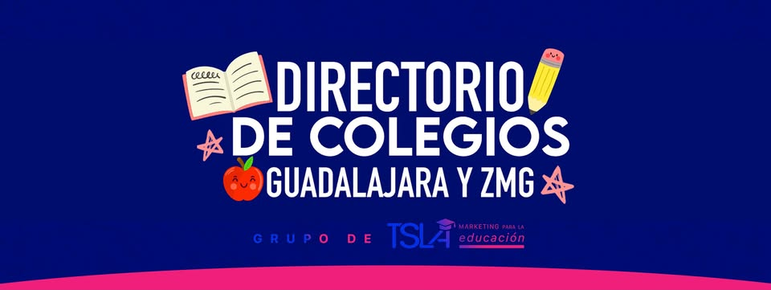

```js
import {multitimeline} from "../components/multitimeline.js";
import {groupstimeline} from "../components/groupstimeline.js";
import {wordNetworkPlot} from "../components/wordNetworkPlot.js";
// import {createVolumeChart} from "../components/volumeChart.js";
const historyData = FileAttachment("../data/history_data.json").json();
const facebookData = FileAttachment("../data/facebook_groups_resonance.json").json();

```

<h1 style="font-size: 2.5rem; color: #1E3A8A; margin-bottom: 1.5rem;">Grupos de Facebook: Resonancia del mundo digital alrededor de Subiré</h1>

Este reporte presenta los resultados preliminares obtenidos de la descarga y exploración de la información rescatada desde: Facebook, Reddit, SCINCE, DENUE y Google Maps para analizar el lugar que ocupa Subiré en el contexto escolar privado de la Zona Metropolitana de Guadalajara, así como el de su principal competencia: The American School Foundation de Guadalajara, la Prepa Tec Santa Anita, el Instituto de Ciencias, entre otros.

<h2 style="font-size: 2rem; color: #1E3A8A; margin-bottom: 1.5rem;">Resonancia en Grupos de Facebook</h2>



La siguiente visualización muestra la actividad y engagement en dos grupos de Facebook específicos relacionados con colegios en Guadalajara:

1. [Directorio de Colegios Guadalajara y ZMG](https://www.facebook.com/groups/directoriocolegiosgdlzmg/) (6,200 miembros)
   - Grupo enfocado a padres de familia para encontrar opciones educativas según zona, presupuesto e intereses
   - Abarca desde guarderías hasta primarias particulares
   - Espacio para que colegios y docentes ofrezcan servicios, horarios extendidos y asesorías

2. [Mejores Colegios de Guadalajara](https://www.facebook.com/groups/mejorescolegiosdeguadalajara/) (9,300 miembros)
   - Grupo especializado en promoción y difusión de colegios en Guadalajara
   - Facilita la toma de decisiones de padres de familia
   - Incluye difusión de espacios culturales y cursos de capacitación educativa

Para estos grupos, se analizan cuatro métricas principales:

- Posts: Cantidad de publicaciones realizadas
- Likes: Total de reacciones positivas
- Comentarios: Interacciones en forma de comentarios
- Compartidos: Veces que el contenido fue compartido

<h3 style="font-size: 1.5rem; color: #059669;">Distribución de Tipos de Engagement</h3>

```js
multitimeline(facebookData, {height: 600})
```

<h4 style="color: #0e7490;">Hallazgos Clave de la Distribución por Tipo de Interacción</h4>

1. **Predominio y evolución de los Likes**
   - Los likes representan la forma más estable y numerosa de interacción en el ecosistema digital de Subiré, alineándose con lo descrito en la introducción sobre la importancia de la percepción digital como indicador de reputación y alcance institucional.
   - Se observan picos claros en los primeros meses de 2024 y mediados de 2023, lo que sugiere la efectividad de campañas, anuncios o eventos escolares para captar la atención de la comunidad, reforzando la necesidad de estrategias de comunicación oportunas y alineadas con el calendario escolar.
   - La estabilidad de los likes, incluso en periodos de menor actividad, evidencia una base de audiencia receptiva y un engagement sostenido, lo que constituye una fortaleza para la consolidación de la presencia digital de Subiré frente a la competencia.

2. **Dinamismo y volatilidad en los Comentarios**
   - Los comentarios muestran una mayor variabilidad que los likes, con picos abruptos y caídas pronunciadas, reflejando la sensibilidad de la comunidad ante temas de alto interés o controversia.
   - Los máximos de comentarios coinciden con los picos generales de actividad, y en ocasiones los superan proporcionalmente, lo que puede indicar debates intensos o publicaciones que generan conversación activa, en línea con el objetivo del proyecto de mapear no solo el volumen, sino la calidad y profundidad de la conversación digital.
   - Estos periodos de alta participación, especialmente a inicios de 2024 y mediados de 2023, sugieren oportunidades para profundizar en el análisis cualitativo de las narrativas predominantes y anticipar posibles focos de crisis o temas emergentes.

3. **Patrones de Compartidos: selectividad y valor informativo**
   - Los compartidos, aunque menos frecuentes, presentan picos que coinciden con los momentos de mayor actividad total, indicando que ciertos contenidos son percibidos como especialmente valiosos o relevantes para la comunidad.
   - La correlación entre los picos de compartidos y los de comentarios/likes refuerza la idea de que los eventos o publicaciones que generan conversación también tienden a ser los que amplifican el alcance de la marca, aspecto clave para la estrategia de posicionamiento digital mencionada en la introducción.
   - Estos hallazgos sugieren que la selectividad en los compartidos puede ser utilizada como un indicador temprano de contenidos con potencial viral o de alto impacto reputacional.

**Conclusiones parciales y relación con el objetivo del proyecto:**  
El análisis de la distribución de interacciones confirma que la percepción digital de Subiré se construye a partir de una base sólida de engagement (likes), pero que los comentarios y compartidos actúan como sensores de temas críticos y oportunidades de amplificación. Estos patrones respaldan la hipótesis inicial del proyecto (ver @intro.md) sobre la importancia de monitorear no solo el volumen, sino la naturaleza y el contexto de la conversación digital para anticipar tendencias, identificar oportunidades de mejora y fortalecer el posicionamiento competitivo de la institución. El monitoreo sistemático de estos indicadores permitirá a Subiré adaptar su estrategia de comunicación, replicar contenidos exitosos y responder de manera proactiva ante posibles crisis o cambios en la percepción de la comunidad.

<h3 style="font-size: 1.5rem; color: #059669;">Engagement por Grupo</h3>

```js
groupstimeline(facebookData, {height: 600})
```

<h4 style="color: #0e7490;">Análisis Detallado por Grupo</h4>

La visualización revela diferencias marcadas en la dinámica de engagement entre los dos principales grupos analizados: **Directorio de Colegios Guadalajara y ZMG** (área azul) y **Mejores Colegios de Guadalajara** (área amarilla).

1. **Participación por Comunidad**
   - El grupo "Directorio de Colegios Guadalajara y ZMG" muestra un dominio claro en la generación de engagement durante la mayor parte del periodo de análisis, especialmente entre febrero y agosto de 2024, donde concentra la mayor parte de la actividad total.
   - A partir de septiembre de 2024, se observa una disminución significativa en la participación de este grupo, mientras que "Mejores Colegios de Guadalajara" incrementa su protagonismo, alcanzando picos de engagement notables en los meses de diciembre 2024, enero y marzo de 2025.
   - Esta alternancia sugiere que cada grupo responde a ciclos y necesidades distintas de la audiencia, posiblemente relacionados con el calendario escolar y campañas de promoción específicas.

2. **Tendencias Temporales y Estacionalidad**
   - Los picos de engagement en ambos grupos tienden a alinearse con momentos clave del ciclo escolar: inscripciones, inicio y cierre de cursos, así como eventos institucionales relevantes.
   - El grupo azul (Directorio) concentra su mayor actividad en el primer semestre del año, mientras que el grupo amarillo (Mejores Colegios) toma relevancia en el cierre del año y el primer trimestre del siguiente, lo que podría estar vinculado a periodos de búsqueda activa de opciones educativas por parte de los padres.
   - Los valles de actividad, especialmente en los meses de septiembre a noviembre y durante vacaciones, reflejan una menor demanda de información y conversación, lo que puede orientar la planificación de campañas y contenidos.

3. **Insights Estratégicos y Oportunidades**
   - La alternancia en el liderazgo de engagement entre los grupos indica la importancia de adaptar la estrategia de comunicación a los ciclos de cada comunidad, maximizando la presencia en los momentos de mayor actividad.
   - Existe una oportunidad clara para fortalecer la participación en los periodos tradicionalmente bajos, ya sea mediante contenido relevante o activaciones específicas que mantengan el interés de la audiencia.
   - La complementariedad entre ambos grupos sugiere que una estrategia integral debe considerar la segmentación de mensajes y acciones diferenciadas, aprovechando los momentos de mayor visibilidad en cada espacio para amplificar el alcance y la resonancia de la marca Subiré.

**En resumen:**  
El análisis detallado de la visualización permite identificar no solo los grupos más influyentes, sino también los periodos óptimos para intervenir y las oportunidades para equilibrar la presencia digital a lo largo del año, anticipando tanto picos de demanda como posibles caídas en la conversación.

<h3 style="font-size: 1.5rem; color: #059669;">Implicaciones Estratégicas: Alineación con los Objetivos del Proyecto</h3>

Las siguientes implicaciones y recomendaciones se derivan directamente de los patrones de resonancia digital identificados y se alinean con los objetivos estratégicos planteados en [Objetivo y Alcance del Proyecto](../01_introduction/intro): fortalecer la percepción digital de Subiré, anticipar tendencias y optimizar el posicionamiento competitivo.

1. **Optimización de Contenido y Narrativa para Impacto Estratégico**
   - Utilizar el análisis de picos de likes y comentarios para identificar temáticas, formatos y estilos de publicación que mejor conectan con la audiencia, especialmente en los periodos clave del ciclo escolar y campañas institucionales, tal como se propone en el objetivo de generar insights accionables.
   - Replicar y adaptar los contenidos que no solo generan likes, sino que también incentivan la conversación (comentarios) y la difusión (compartidos), maximizando así el alcance y la reputación digital, en línea con la meta de consolidar la presencia institucional.
   - Aprovechar los periodos de menor actividad (septiembre-noviembre y vacaciones) para experimentar con nuevos formatos, historias de éxito y testimonios, manteniendo el interés y preparando el terreno para los siguientes picos de demanda, contribuyendo a la construcción de una presencia digital más sólida y continua.
   - Ajustar la narrativa y el tono de los mensajes según el grupo y el momento del ciclo escolar, diferenciando la comunicación para padres en búsqueda activa de opciones educativas y para comunidades ya establecidas, reforzando la relevancia y pertinencia de la estrategia de contenidos.

2. **Gestión Estratégica y Segmentada de Comunidad**
   - Priorizar la presencia y participación en el grupo "Directorio de Colegios Guadalajara y ZMG" durante el primer semestre, y en "Mejores Colegios de Guadalajara" en el cierre y arranque de ciclo escolar, alineando la estrategia con los patrones de estacionalidad y los momentos de mayor toma de decisión, como se establece en los objetivos del informe.
   - Implementar acciones específicas para reactivar la conversación en periodos de baja actividad, como dinámicas, encuestas o contenidos interactivos, respondiendo a las necesidades puntuales de cada comunidad y fomentando el engagement sostenido.
   - Segmentar la comunicación y campañas según el perfil y ciclo de vida de cada grupo, aprovechando la complementariedad entre ambos para maximizar el alcance y la relevancia de la marca Subiré a lo largo del año.
   - Mantener un calendario editorial flexible y adaptativo, que permita responder rápidamente a eventos coyunturales o temas emergentes detectados en los picos de comentarios y compartidos, anticipando oportunidades y riesgos.

3. **Monitoreo Proactivo y Respuesta Ágil para la Gestión de la Percepción**
   - Establecer un sistema de monitoreo en tiempo real para identificar picos inusuales de actividad, especialmente en comentarios y compartidos, permitiendo anticipar tanto oportunidades (temas virales, interés genuino) como riesgos (controversias, crisis), en concordancia con el objetivo de anticipar tendencias y gestionar la reputación.
   - Preparar protocolos de respuesta rápida para intervenir en conversaciones de alto engagement, potenciando mensajes positivos o gestionando posibles crisis antes de que escalen, asegurando una gestión proactiva de la percepción digital.

<!-- ```js
const facebookGroupNetworkData = FileAttachment("../data/fb_groups_with_comments_word_graph.json").json();
```

```js
wordNetworkPlot(facebookGroupNetworkData, {height: 600,title: "Subiré Business School Word Network"})
``` -->

