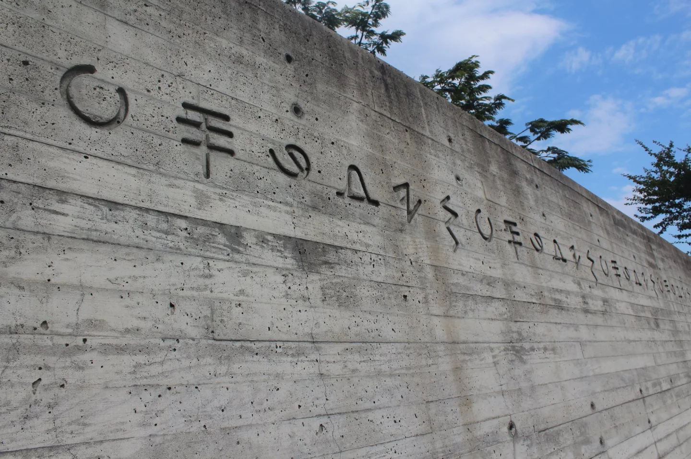
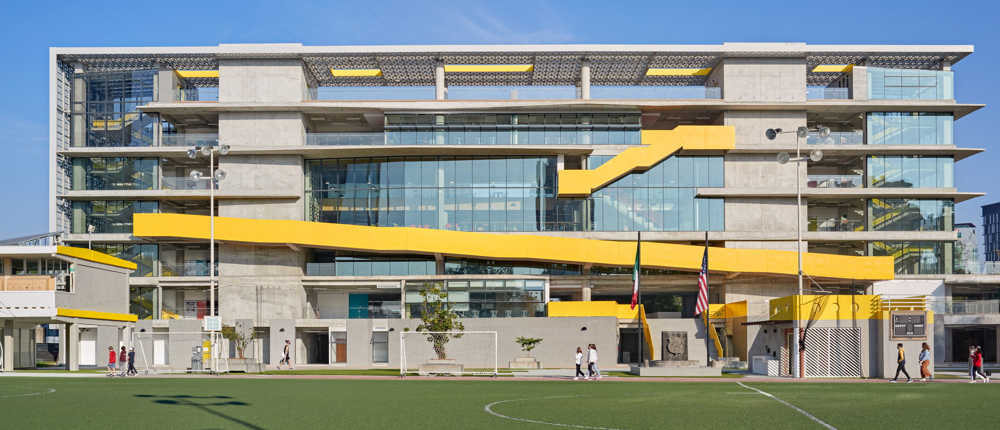
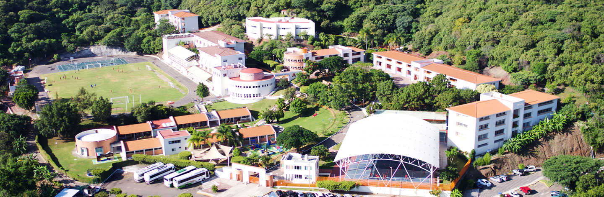
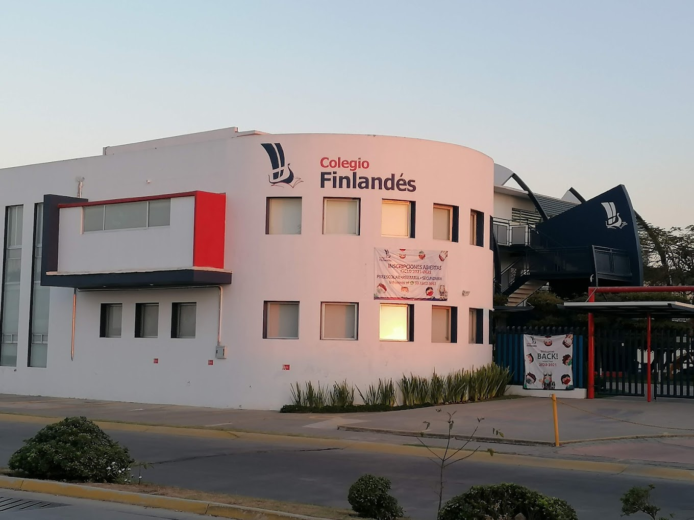
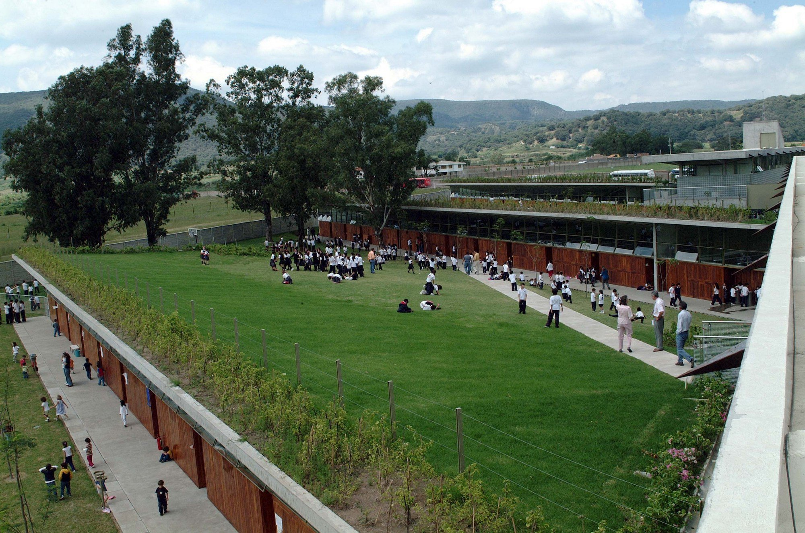
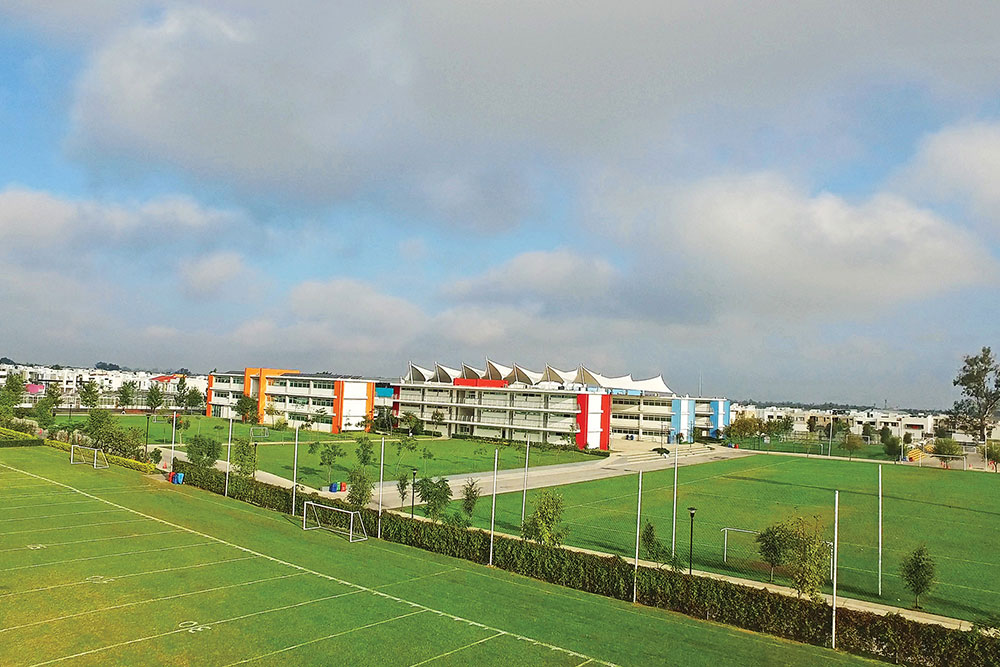
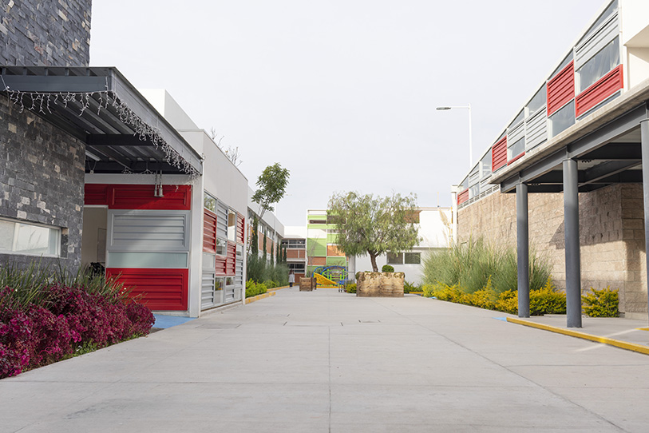
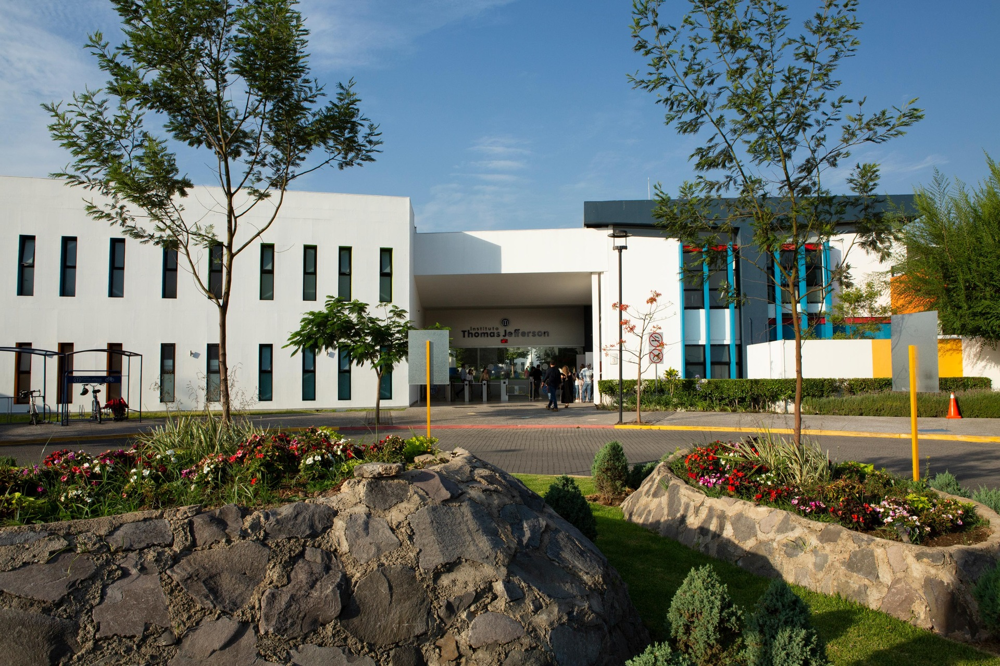
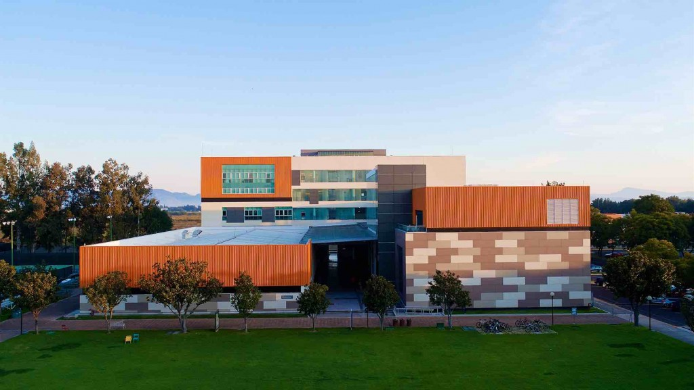
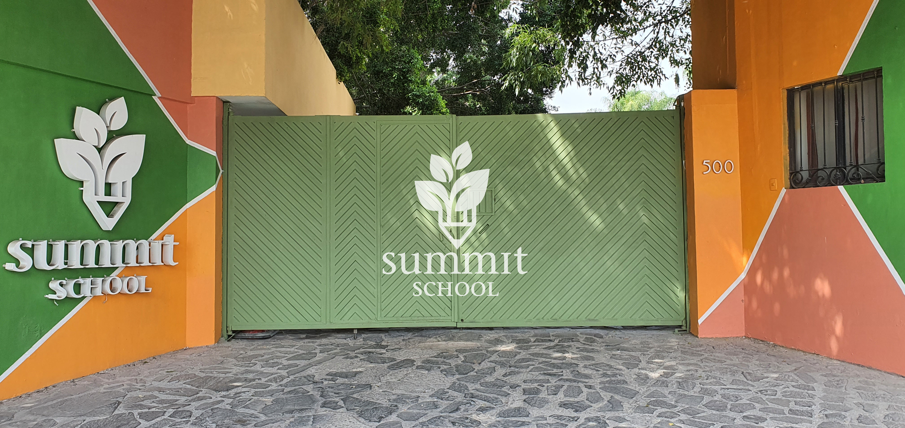

<h1 style="font-size:2.5rem; color:#1E3A8A; margin-top:2rem; margin-bottom:1.5rem;">Benchmark competitivo de oferta de valor</h1>

<h2 style="font-size:2rem; color:#1E3A8A; margin-top:2rem; margin-bottom:1.5rem;">I. Definir Objetivos y Alcance</h2>

Para comparar eficazmente las ofertas educativas, nos enfocamos idealmente en los aspectos específicos de valor para los consumidores, como programas académicos, metodologías de enseñanza, actividades extracurriculares, programas internacionales, integración tecnológica, valores, procesos de admisión e información para padres.

<h2 style="font-size:2rem; color:#1E3A8A; margin-top:2rem; margin-bottom:1.5rem;">II. Principales hallazgoos de la competencia</h2>

<h3 style="font-size:1.5rem; color:#1E3A8A; margin-top:2rem; margin-bottom:1.5rem;">Signos</h3>

<ul style="font-size:1rem; margin-bottom:1.5rem;">
  <li>Escuela especializada en adolescentes fundada en los 90s por María E. Fors</li>
  <li>Enfoque único en el proceso adolescente basado en psicoanálisis, reconociendo 5 fases de desarrollo: preadolescencia, adolescencia temprana, adolescencia tardía y posadolescencia</li>
  <li>Proyecto pedagógico abierto orientado a la transformación social y civilizatoria</li>
  <li>Escuela libre de celulares desde 2016-2017 para toda la comunidad durante horario escolar, con investigación activa sobre su impacto en adolescentes</li>
  <li>Sólidos fundamentos teóricos:
    <ul>
      <li>Biológico: teoría de la evolución</li>
      <li>Epistemológico: constructivismo psicogenético</li>
      <li>Psicológico: teoría psicoanalítica</li>
      <li>Sociológico: teoría crítica</li>
    </ul>
  </li>
  <li>Ambiente de aprendizaje caracterizado por:
    <ul>
      <li>Trabajo y amor al conocimiento</li>
      <li>Diálogo y pensamiento crítico</li>
      <li>Creatividad y cooperación</li>
      <li>Transformación social</li>
    </ul>
  </li>
  <li>Compromiso ambiental desde 2000:
    <ul>
      <li>Proyecto de separación de residuos iniciado por estudiantes</li>
      <li>Vinculación con el Centro de Cultura Ambiental (CCAIE)</li>
      <li>Participación en proyectos como Guardianes del Bosque</li>
    </ul>
  </li>
  <li>Nombre inspirado en signos del alefato fenicio:
    <ul>
      <li>Beth (casa): pertenencia, confianza y conocimiento</li>
      <li>Daleth (puerta): apertura al conocimiento y rol docente</li>
    </ul>
  </li>
</ul>

<h3 style="font-size:1.5rem; color:#1E3A8A; margin-top:2rem; margin-bottom:1.5rem;">ASFG (American School Foundation of Guadalajara)</h3>

<ul style="font-size:1rem; margin-bottom:1.5rem;">
  <li>Misión y valores fundamentales:
    <ul>
      <li>Formación de seres humanos críticos, libres y honorables</li>
      <li>Educación en ambiente bilingüe, bicultural y laico</li>
      <li>Desarrollo de aprendices con propósito y pensadores críticos</li>
      <li>Énfasis en honradez, libertad y compromiso comunitario</li>
    </ul>
  </li>
  <li>Trayectoria e historia:
    <ul>
      <li>108 años de presencia en Guadalajara</li>
      <li>Evolución desde escuela para expatriados a institución integral</li>
      <li>Refleja el crecimiento de Guadalajara como metrópolis global</li>
      <li>Constituida como Asociación Civil sin fines de lucro desde 1956</li>
    </ul>
  </li>
  <li>Acreditaciones y validación:
    <ul>
      <li>Incorporada a la SEJ (primera infancia a 9° grado)</li>
      <li>Acuerdo con UNAM para programa de preparatoria</li>
      <li>Revalidación SEP para grados 10-12</li>
      <li>Acreditación SACS CASI/AdvancED (pre-kínder a 12° grado)</li>
    </ul>
  </li>
  <li>Programas distintivos:
    <ul>
      <li>Modelo educativo bilingüe y bicultural integral</li>
      <li>Programa de Aprendizaje-Servicio comunitario</li>
      <li>Desarrollo de ciudadanos globales</li>
      <li>Oficina de Desarrollo y Relaciones Comunitarias</li>
    </ul>
  </li>
  <li>Objetivos de formación:
    <ul>
      <li>Desarrollo de líderes constructivos y proactivos</li>
      <li>Fomento de habilidades interpersonales y trabajo en equipo</li>
      <li>Compromiso con paz, diversidad y responsabilidad ambiental</li>
      <li>Preparación para éxito académico internacional</li>
    </ul>
  </li>
</ul>

<h3 style="font-size:1.5rem; color:#1E3A8A; margin-top:2rem; margin-bottom:1.5rem;">Colegio Alemán Guadalajara</h3>

<ul style="font-size:1rem; margin-bottom:1.5rem;">
  <li>Escuela mexicano-alemana, trilingüe (español, alemán, inglés) y laica fundada en 1979 por familias alemanas y suizas</li>
  <li>Certificaciones y reconocimientos:
    <ul>
      <li>"Colegio Alemán de Excelencia" otorgado por gobierno alemán (2009, reafirmado 2014)</li>
      <li>Diploma de Bachillerato Internacional (IB)</li>
      <li>Diploma de Alemán (DSD II)</li>
      <li>Certificados de Inglés (FCE - CAE)</li>
      <li>Certificado Nivel A2 en Alemán (primaria)</li>
      <li>Incorporado a la SEP</li>
    </ul>
  </li>
  <li>Metodología educativa:
    <ul>
      <li>Enfoque en resolución de problemas y descubrimiento</li>
      <li>Estrategias colaborativas y diferenciadas</li>
      <li>Desarrollo de madurez intelectual, social y emocional</li>
      <li>Promoción de valores universales: respeto, disciplina, tolerancia</li>
    </ul>
  </li>
  <li>Programa deportivo integral:
    <ul>
      <li>Deportes principales: fútbol, baloncesto, balonmano, voleibol, natación</li>
      <li>Psicomotricidad y atletismo desde niveles básicos</li>
    </ul>
  </li>
  <li>Actividades especiales y culturales:
    <ul>
      <li>Modelo de Naciones Unidas: AleMUN y HumboldtMUN</li>
      <li>Eventos culturales: Carnaval, Teatro, Noche de Talentos</li>
      <li>Tradiciones alemanas: Laternenfest, Advent, Osterhase</li>
      <li>Viajes académicos y robótica</li>
      <li>Prácticas laborales y Expo-Universitaria</li>
    </ul>
  </li>
  <li>Requisitos lingüísticos:
    <ul>
      <li>Nivel B1 en alemán para Bachillerato</li>
      <li>Nivel A2/B1 para Secundaria</li>
      <li>Enseñanza del alemán desde Kindergarten</li>
    </ul>
  </li>
  <li>Programa de intercambio con países germanoparlantes para estudiantes de secundaria</li>
  <li>Instalaciones modernas con recursos tecnológicos actualizados</li>
  <li>Enfoque en conciencia social, ecológica y participativa</li>
</ul>

<h3 style="font-size:1.5rem; color:#1E3A8A; margin-top:2rem; margin-bottom:1.5rem;">Colegio Finlandes</h3>

<ul style="font-size:1rem; margin-bottom:1.5rem;">
  <li>Educación bilingüe (inglés/español) desde preescolar hasta secundaria:
    <ul>
      <li>Aprendizaje natural del inglés adaptado a cada edad</li>
      <li>Uso de frases cortas, lectura y escritura según nivel</li>
      <li>Opción de tercer idioma en secundaria</li>
    </ul>
  </li>
  <li>Filosofía Reggio Emilia en preescolar:
    <ul>
      <li>Estudiante como protagonista del aprendizaje</li>
      <li>Docente como guía</li>
      <li>Ambiente colaborativo que promueve creatividad</li>
      <li>Aprendizaje por investigación y experimentación</li>
    </ul>
  </li>
  <li>Programa de primaria:
    <ul>
      <li>Fomento de curiosidad científica y lectura temprana</li>
      <li>Proyectos transversales prácticos</li>
      <li>Tareas apropiadas para cada edad</li>
      <li>Énfasis en aprendizaje motivado por intereses</li>
      <li>Desarrollo de habilidades de investigación y colaboración</li>
      <li>Bajo nivel de estrés y flexibilidad</li>
    </ul>
  </li>
  <li>Secundaria:
    <ul>
      <li>Desarrollo integral con tecnología</li>
      <li>Proyectos multidisciplinarios</li>
      <li>Guía personalizada según intereses y capacidades</li>
      <li>Comunicación continua y cercana</li>
    </ul>
  </li>
  <li>Modelo inspirado en educación finlandesa:
    <ul>
      <li>Excelente nivel académico</li>
      <li>Horarios apropiados para cada edad</li>
      <li>Tareas significativas pero breves</li>
      <li>Atención personalizada</li>
    </ul>
  </li>
  <li>Presencia e infraestructura:
    <ul>
      <li>Campus en Guadalajara Sur y Zapopan Solares</li>
      <li>Ambiente cálido y seguro</li>
      <li>Educación internacional accesible desde 2006</li>
    </ul>
  </li>
  <li>Colaboración internacional:
    <ul>
      <li>Vínculos activos con escuelas en Finlandia</li>
      <li>Intercambio de experiencias e innovación continua</li>
    </ul>
  </li>
  <li>Comunidad educativa:
    <ul>
      <li>Fuerte vinculación entre familias</li>
      <li>Participación de guías y especialistas</li>
      <li>Énfasis en experiencias positivas y amistades duraderas</li>
    </ul>
  </li>
</ul>

<h3 style="font-size:1.5rem; color:#1E3A8A; margin-top:2rem; margin-bottom:1.5rem;">Colegio Franco Mexicano</h3>

<ul style="font-size:1rem; margin-bottom:1.5rem;">
  <li>Modelo pedagógico de excelencia que fomenta la interculturalidad, plurilingüismo, autonomía y pensamiento libre para formar ciudadanos abiertos al mundo</li>
  <li>Única escuela en Jalisco miembro de la AEFE (Agence pour l'Enseignement Français à l'Étranger) desde 2002:
    <ul>
      <li>Red educativa más grande del mundo con 532 escuelas en 139 países</li>
      <li>Garantiza calidad y excelencia de educación francesa en el extranjero</li>
      <li>Supervisada por el Ministerio de Asuntos Exteriores de Francia</li>
    </ul>
  </li>
  <li>Programa académico trilingüe:
    <ul>
      <li>Francés desde maternal (3-5 años) con enfoque en lenguaje, actividades físicas y artísticas</li>
      <li>Inglés desde primaria con lectura, expresión oral/escrita y comprensión</li>
      <li>Alemán en preparatoria</li>
    </ul>
  </li>
  <li>Acceso garantizado a centros educativos AEFE globalmente sin examen de admisión</li>
  <li>Preparatoria con diploma BAC internacional:
    <ul>
      <li>Reconocido por universidades en 5 continentes</li>
      <li>Apoyo especializado para estudios superiores en Francia</li>
      <li>Costos de examen: $2,500 en Première y $4,500 en Terminale</li>
    </ul>
  </li>
  <li>Programa integral de desarrollo sostenible "ECO franco":
    <ul>
      <li>Candidato a certificación EFE3D de AEFE</li>
      <li>Huerto escolar, compostaje, tratamiento de aguas y reciclaje</li>
    </ul>
  </li>
  <li>Programas de intercambio en 140 países a través de red AEFE manteniendo colegiatura</li>
  <li>Sección Deportiva para atletas de alto rendimiento:
    <ul>
      <li>Programa Personalizado PPES con horarios adaptados</li>
      <li>Academia de fútbol en colaboración con Club Deportivo Atlas</li>
    </ul>
  </li>
  <li>Más de 70 años de presencia en Guadalajara:
    <ul>
      <li>Campus moderno en El Bajío (2006) diseñado por arquitectos reconocidos</li>
      <li>Instalaciones incluyen cafetería, huerto, bibliotecas y estudio de radio</li>
      <li>Sistema Pronote para comunicación con padres</li>
    </ul>
  </li>
</ul>

<h3 style="font-size:1.5rem; color:#1E3A8A; margin-top:2rem; margin-bottom:1.5rem;">Subiré Business School</h3>

<ul style="font-size:1rem; margin-bottom:1.5rem;">
  <li>Modelo educativo integral:
    <ul>
      <li>Excelencia académica certificada por College Board</li>
      <li>Sistema bilingüe-bicultural</li>
      <li>Educación financiera desde preescolar hasta bachillerato</li>
      <li>Formación deportiva y artística como pilares del desarrollo personal</li>
      <li>Contacto con vida rural a través de granja didáctica</li>
    </ul>
  </li>
  <li>Enfoque emprendedor distintivo:
    <ul>
      <li>Programas prácticos desde comprensión monetaria hasta creación de empresas</li>
      <li>Alianzas con cámaras empresariales</li>
      <li>Consejo Académico de Emprendedores para retroalimentación</li>
      <li>Implementación práctica de creatividad en formación empresarial</li>
    </ul>
  </li>
  <li>Metodología innovadora:
    <ul>
      <li>Modelo constructivista centrado en el estudiante</li>
      <li>Uso de TICs y plataforma Moodle</li>
      <li>Preceptorías para regularización académica</li>
      <li>Desarrollo de hábitos de lectura, estudio e investigación</li>
      <li>Intercambios internacionales</li>
    </ul>
  </li>
  <li>Formación integral:
    <ul>
      <li>Ambiente basado en valores de respeto, justicia y orden</li>
      <li>Programa anti-bullying</li>
      <li>Disciplina positiva enfocada en autorregulación</li>
      <li>Apoyo psicopedagógico</li>
      <li>Campamentos y excursiones</li>
    </ul>
  </li>
  <li>Vinculación con padres:
    <ul>
      <li>Formación continua en desarrollo personal y familiar</li>
      <li>Participación de padres empresarios en conferencias</li>
      <li>Proyectos de servicio</li>
      <li>Apoyo en trabajo académico vespertino</li>
    </ul>
  </li>
  <li>Sustentabilidad:
    <ul>
      <li>Educación ambiental integrada al currículo</li>
      <li>Granja didáctica como espacio de aprendizaje experiencial</li>
      <li>Proyectos de responsabilidad ecológica</li>
    </ul>
  </li>
</ul>

<h3 style="font-size:1.5rem; color:#1E3A8A; margin-top:2rem; margin-bottom:1.5rem;">IT Innovation School</h3>

<ul style="font-size:1rem; margin-bottom:1.5rem;">
  <li>5 niveles escolares bilingües (inglés/español) en campus Guadalajara</li>
  <li>Modelo educativo: Constructivismo Social basado en indagación guiada</li>
  <li>Propuestas de aprendizaje innovadoras y desafiantes en ambientes lúdicos y colaborativos</li>
  <li>Búsqueda de excelencia integral para producir estudiantes competitivos a nivel mundial</li>
  <li>Múltiples campus en México</li>
  <li>Más de 39 años de experiencia en formación integral de jóvenes</li>
  <li>Enfoque en perfil académico, deportivo y artístico de alto nivel</li>
  <li>Sistema bilingüe con estrictos estándares de calidad y marco académico propio</li>
  <li>Metodología promueve movilización de conocimientos y logro de aprendizajes esperados</li>
  <li>Campus Guadalajara ubicado en San Juan de Ocotán, Zapopan</li>
</ul>

<h3 style="font-size:1.5rem; color:#1E3A8A; margin-top:2rem; margin-bottom:1.5rem;">ITJ Campus Valle Real</h3>

<ul style="font-size:1rem; margin-bottom:1.5rem;">
  <li>Desarrollo de habilidades y talentos únicos de cada estudiante</li>
  <li>Preparación para universidades prestigiosas nacionales e internacionales</li>
  <li>Programa primario basado en instrucción basada en investigación</li>
  <li>Alineado con estándares Common Core y AERO, enseñado en inglés</li>
  <li>Acreditaciones: NEASC, ASOMEX, TRI-AREA ASSOCIATION OF AMERICAN SCHOOLS</li>
  <li>Ofrece Diploma de Preparatoria Internacional</li>
  <li>Introducción al inglés en preescolar, programa de inmersión en inglés desde Pre-Kinder</li>
  <li>Clases de mandarín en secundaria, opción de idioma adicional en preparatoria</li>
  <li>Instalaciones certificadas LEED como escuela verde</li>
  <li>Parte de International Schools Partnership (ISP), grupo global con más de 88 escuelas</li>
  <li>Conexiones internacionales únicas y aprendizaje con estándares de calidad mundial</li>
</ul>

<h3 style="font-size:1.5rem; color:#1E3A8A; margin-top:2rem; margin-bottom:1.5rem;">PrepaTec Santa Margarita (Tecnológico de Monterrey)</h3>

<ul style="font-size:1rem; margin-bottom:1.5rem;">
  <li>Énfasis en autodescubrimiento y crecimiento integral</li>
  <li>Preparación para éxito en Tec y universidades top mundiales</li>
  <li>Programas desarrollan competencias clave combinando conocimientos, habilidades y actitudes</li>
  <li>Ofrece programas:
    <ul>
      <li>PrepaTec Bicultural: Enfocado en adquirir o fortalecer habilidades en inglés</li>
      <li>PrepaTec Multicultural: Desarrolla visión global e incluye aprendizaje de tercer idioma</li>
      <li>PrepaTec Internacional (IB): Programa de Bachillerato Internacional con certificación internacional</li>
    </ul>
  </li>
  <li>Iniciativa Road to College y Programa de College Counseling para estudios en el extranjero</li>
  <li>Opción de revalidar créditos en prestigiosas universidades internacionales</li>
  <li>Múltiples campus en todo México</li>
</ul>

<h3 style="font-size:1.5rem; color:#1E3A8A; margin-top:2rem; margin-bottom:1.5rem;">SUMMIT SCHOOL</h3>

<ul style="font-size:1rem; margin-bottom:1.5rem;">
  <li>Escuela privada bilingüe con tendencia vanguardista, alineada con otros modelos educativos de vanguardia como IT Innovation School y Subiré</li>
  <li>Evaluación personalizada del tipo de inteligencia y habilidades de cada estudiante para adaptar métodos de enseñanza, similar al enfoque de Colegio Finlandés e ITJ Valle Real</li>
  <li>Modelo educativo basado en Constructivismo y Humanismo:
    <ul>
      <li>Centrado en el estudiante como protagonista de su aprendizaje</li>
      <li>Programa 100% bilingüe con dominio de inglés y español</li>
      <li>Comparte fundamentos constructivistas con IT Innovation School y Subiré</li>
      <li>Enfoque humanista alineado con el modelo emprendedor-humanista de Subiré</li>
    </ul>
  </li>
  <li>Programa educativo integral:
    <ul>
      <li>Basado en competencias que combinan conocimientos, habilidades y actitudes</li>
      <li>Aprendizaje experiencial en contacto con la naturaleza</li>
      <li>Granja didáctica como espacio de aprendizaje vivencial</li>
      <li>Similar a programas de Subiré y Colegio Franco Mexicano</li>
    </ul>
  </li>
  <li>Fuerte compromiso con la sustentabilidad:
    <ul>
      <li>Dedicación al cuidado ambiental y educación ecológica</li>
      <li>Interacción con animales en granja escolar</li>
      <li>Alineado con iniciativas sustentables de Subiré y el programa Eco Franco</li>
    </ul>
  </li>
</ul>

  <h2 style="font-size:2rem; color:#1E3A8A; margin-top:0; margin-bottom:1.5rem;">III. Análisis Masivo de Texto Impulsado por IA:</h2>

  

    <h1 style="font-size:2.5rem; color:#1E3A8A; margin-top:0; margin-bottom:1rem;">Modelado de Temas</h1>
    
Se revelan temas clave como educación bilingüe, programas internacionales, aprendizaje centrado en el estudiante, integración tecnológica, formación en valores y áreas académicas específicas como ciencia, artes y deportes. Estos temas son discutidos por diferentes escuelas. Por ejemplo, el término bilingüe aparece con frecuencia en el Colegio Finlandés, IT Innovation School e ITJ. La palabra internacional es prominente en el Colegio Alemán, Colegio Franco Mexicano, PrepaTec e ITJ. El desarrollo adolescente es un tema clave para Signos, mientras que emprendimiento destaca en SUBIRE.

  

  

    <h1 style="font-size:2.5rem; color:#1E3A8A; margin-top:0; margin-bottom:1rem;">Extracción de Palabras Clave</h1>
    
Se destacan términos frecuentemente utilizados como los nombres de programas, por ejemplo, Bachillerato Internacional, AEFE, Reggio Emilia; metodologías como constructivismo y aprendizaje basado en proyectos; y valores como respeto, autonomía y creatividad para cada escuela.

  

  

    <h1 style="font-size:2.5rem; color:#1E3A8A; margin-top:0; margin-bottom:1rem;">Análisis de Sentimientos</h1>
    
Se mide el tono general utilizado por cada escuela al describir su entorno y experiencia estudiantil. Por ejemplo, el Colegio Finlandés utiliza frases como niños cumpliendo sus sueños y estudiantes felices aprendiendo, lo que sugiere un sentimiento positivo.

  

  

    <h1 style="font-size:2.5rem; color:#1E3A8A; margin-top:0; margin-bottom:1rem;">Reconocimiento de Entidades Nombradas (NER)</h1>
    
Se identifican y categorizan entidades específicas como acreditaciones, por ejemplo, AEFE para Colegio Franco Mexicano y NEASC para ITJ; idiomas como alemán para Colegio Alemán, francés para Colegio Franco Mexicano y mandarín para ITJ; y afiliaciones como Tecnológico de Monterrey para PrepaTec.

  

## IV. Análisis comparativo:

1. **Integración de "Vida de Campo" y una Granja Didáctica:**

SuBiré ofrece de manera única una granja didáctica con instalaciones ideales para prácticas de campo. Los estudiantes interactúan con profesionales del desarrollo agrícola y aprenden a valorar la tierra y la producción de alimentos. La ecología y el cuidado de la naturaleza se ponen en práctica. Este compromiso directo con la naturaleza y el aprendizaje agrícola parece ser un diferenciador significativo.

<strong>SUMMIT SCHOOL</strong> menciona una dedicación al cuidado ambiental y la interacción con animales, y el <strong>Colegio SuBiré</strong> promueve la conciencia ambiental a través de su granja didáctica, el nivel de integración en el currículo parece más profundo en SuBiré. El <strong>Colegio Franco Mexicano</strong> tiene un huerto escolar como parte de su proyecto ecológico, y el <strong>ITJ Campus Valle Real</strong> menciona que su programa de primaria busca crear estudiantes conscientes del medio ambiente, pero ninguno describe una granja didáctica completa como parte central de su oferta.

2. **"Escuela de Negocios" y Énfasis en la Formación Emprendedora con un Sentido Humano:**

SuBiré tiene un programa dedicado de "Escuela de Negocios" en los niveles de primaria, secundaria y preparatoria. Este programa se enfoca en enseñar a los estudiantes cómo operan los negocios, incluyendo responsabilidades, creación de planes de negocio e inversión. Incluso tienen una exposición anual donde los estudiantes presentan sus empresas desarrolladas.

La filosofía y misión de la escuela destacan la <strong>"formación emprendedora con un sentido humano"</strong>. Este enfoque en desarrollar habilidades emprendedoras desde una edad temprana y fundamentarlas en valores humanísticos parece distintivo.

<strong>PrepaTec</strong> menciona el desarrollo de un "liderazgo emprendedor", y el <strong>ITJ Campus Valle Real</strong> alude al desarrollo de un "espíritu emprendedor y autogestivo" en su perfil estudiantil, pero ninguno describe un programa estructurado de "Escuela de Negocios" integrado a lo largo de los diferentes niveles escolares.

3. **Fuerte Énfasis en una Formación de Cuatro Pilares:**

SuBiré establece explícitamente una prioridad en el aprendizaje académico, financiero, deportivo y cultural, junto con el contacto con la vida rural. Este enfoque equilibrado en estas cuatro áreas clave es central en su filosofía.

Mientras que muchas escuelas ofrecen actividades extracurriculares en deportes y artes <em>(por ejemplo, el <strong>Colegio Alemán Guadalajara</strong> enumera varios deportes y actividades especiales como teatro y competencias)</em>, la priorización explícita e igualitaria de la educación financiera y la "vida de campo" junto con lo académico y deportivo/cultural parece distinguir a SuBiré.

4. **Enfoque en Valores y Formación de Carácter:**

SuBiré enfatiza la formación de individuos que son seguros de sí mismos, pueden formar una familia y contribuir a una sociedad renovada en un entorno de valores. Mencionan valores católicos, un ambiente fraternal, respeto, justicia, orden y un programa contra el acoso escolar.

El <strong>Colegio Alemán Guadalajara</strong> también enfatiza valores universales como el respeto, la diversidad, la disciplina, la tolerancia y la honestidad, así como la conciencia social y ecológica. <strong>SUMMIT SCHOOL</strong> enumera valores como la tolerancia, la honestidad, la responsabilidad y el respeto por la naturaleza. Sin embargo, la mención explícita de SuBiré de los valores católicos y la integración de estos valores en su declaración de misión podría ser un factor diferenciador para ciertas familias.

5. **Integración de Tecnología e Innovación dentro de un Modelo Constructivista:**

SuBiré aplica un modelo educativo constructivista donde el estudiante es central y responsable de su aprendizaje, con el docente como facilitador. También emplean recursos de tecnología de la información, investigación y comunidades virtuales.

El modelo educativo de <strong>IT Innovation School</strong> es el Constructivismo Social basado en la indagación guiada <em></em>. El nivel secundario del <strong>ITJ Campus Valle Real</strong> utiliza una estructura constructivista con aprendizaje basado en proyectos. El énfasis del <strong>Colegio SuBiré</strong> en la responsabilidad del estudiante por su aprendizaje dentro de este modelo, combinado con sus otros elementos únicos, contribuye a su distintividad.

<strong>Puntos de Diferenciación Menos Claros o Posible Superposición:</strong>

- **Bilingüismo:** SuBiré ofrece un sistema bilingüe-bicultural. Muchas otras escuelas en las fuentes también son bilingües o multilingües, como <strong>IT Innovation School</strong> (inglés/español) <em></em>, <strong>ITJ Campus Valle Real</strong> (principalmente inglés) <em></em>, <strong>Colegio Alemán Guadalajara</strong> (alemán, español, inglés), <strong>Colegio Franco Mexicano</strong> (francés, inglés, español, alemán) y <strong>Colegio Finlandés</strong> (preescolar, primaria y secundaria bilingües). Por lo tanto, el bilingüismo en sí mismo no es un diferenciador único.

- **Excelencia Académica:** SuBiré destaca una sólida formación académica y menciona estar categorizada como una Escuela de Alta Calidad Educativa por College Board. La mayoría de las escuelas en las fuentes también afirman excelencia académica y preparación para la educación superior.

- **Énfasis en el Desarrollo Integral:** SuBiré apunta a la formación humana integral de sus estudiantes. Muchas otras escuelas, como <strong>IT Innovation School</strong>, <strong>ITJ Campus Valle Real</strong>, <strong>PrepaTec</strong> y <strong>Colegio Finlandés</strong>, también enfatizan el desarrollo integral de sus estudiantes.

<h1 style="font-size:2.5rem; color:#1E3A8A; margin-top:2rem; margin-bottom:1.5rem;">V. Análisis Cualitativo y Revisión Manual</h1>

  

    <h1 style="font-size:2.5rem; color:#1E3A8A; margin-top:0; margin-bottom:1rem;">Signos</h1>
    
Como se declara explícitamente, Signos fue creada a principios de los años 90 como una escuela específicamente para adolescentes. Su fundadora, María E. Fors, buscó abordar la falta de atención y comprensión del proceso adolescente en las escuelas tradicionales.

    
Signos se compromete a entender, contener, conocer y atender el proceso adolescente para beneficiar su aprendizaje general. La escuela se basa en los descubrimientos del psicoanálisis y reconoce las cinco fases del desarrollo adolescente: preadolescencia, adolescencia temprana, adolescencia tardía y posadolescencia.

    
Los docentes de Signos consideran estas fases en su trabajo educativo para apoyar a los estudiantes en su desarrollo adolescente, con el objetivo de ayudarlos a convertirse en adultos autónomos capaces de trabajo creativo, amor y compromiso comunitario.

    
Desde el año escolar 2016-2017, Signos ha sido una escuela libre de teléfonos celulares, tanto para docentes como para estudiantes durante el día laboral/escolar. Esta política surge de la creencia de que el uso constante de teléfonos celulares socava la tolerancia a la frustración y la capacidad de "mirar" y "mirarnos". Los docentes de Signos investigan activamente estos temas para profundizar su postura sobre los teléfonos celulares y los adolescentes.

    
El nombre "Signos" fue elegido deliberadamente para no referirse directamente a una persona o ideal, sino para ganar significado a través de las experiencias dentro de la escuela. El nombre enfatiza cómo entendemos nuestro entorno y nos comunicamos a través de signos. La presentación de la escuela incluye signos del alfabeto fenicio para simbolizar el valor de los orígenes, ya que este alfabeto es un precursor de nuestro lenguaje.

    
Signos busca fomentar un ambiente de trabajo que valore el amor por el conocimiento, el diálogo, la crítica, la creatividad, la cooperación y la transformación social tanto para jóvenes como para adultos.

  

  

    <h1 style="font-size:2.5rem; color:#1E3A8A; margin-top:0; margin-bottom:1rem;">ASFG</h1>
    
El video transcrito de ASFG México destaca su larga historia de 108 años en Guadalajara. ASFG enfatiza la formación de seres humanos críticos, libres y honorables.

    
La escuela se enorgullece de su educación integral, bilingüe y bicultural, un compromiso que ha mantenido durante más de un siglo. ASFG busca proporcionar a los estudiantes oportunidades de crecimiento arraigadas en valores, fomentando un sentido de familia y unidad, y alentando a los estudiantes a cuidar de los demás.

    
El modelo educativo de la escuela se describe como un modelo nacional bilingüe que prepara a los estudiantes para alcanzar sus metas en cualquier parte del mundo. El objetivo de ASFG es ser una comunidad con excelencia académica internacional que trabaje en conjunto para la formación integral de profesionales nobles y comprometidos.

  

  

    <h1 style="font-size:2.5rem; color:#1E3A8A; margin-top:0; margin-bottom:1rem;">Colegio Alemán Guadalajara</h1>
    
Fundado en 1979 por familias alemanas y suizas en Guadalajara, el Colegio Alemán es una escuela trilingüe (español, alemán, inglés) y laica orientada hacia la excelencia con certificaciones internacionales. En 2009 y reafirmado en 2014, recibió la distinción de "Colegio Alemán de Excelencia en el Extranjero" del gobierno alemán. Esta fundación fue impulsada por padres que buscaban mejores opciones educativas para sus hijos.

    
La misión de la escuela es ser una escuela mexicana-alemana, trilingüe y laica enfocada en la excelencia que promueve una educación integral certificada internacionalmente. Enfatiza valores universales como el respeto (incluyendo la diversidad), la disciplina, la tolerancia y la honestidad, y fomenta el juego limpio y el trabajo en equipo. También busca desarrollar conciencia social, ecológica y participativa.

    
Los idiomas español, alemán e inglés son fundamentales para su enseñanza. El Colegio Alemán desarrolla la responsabilidad personal a través del esfuerzo, el trabajo y la capacidad de hacer y cumplir compromisos, utilizando la tecnología moderna de manera racional.

    
Su visión, "Zukunftsfähige Schule" (escuela viable para el futuro), es formar estudiantes con fuertes valores comprometidos con la comunidad, capaces de transformar la sociedad y contribuir con sus habilidades para construir un mundo más humano y sostenible. Sus egresados están destinados a tener éxito personal, social y profesionalmente.

    
Para la admisión al Bachillerato (nivel de preparatoria), un nivel B1 en alemán es indispensable. La escuela ofrece varias certificaciones, incluyendo el certificado SEP, el Diploma de Bachillerato Internacional, el Diploma de Lengua Alemana (DSD II) y certificados de inglés (FCE – CAE). El Bachillerato sigue la metodología del Bachillerato Internacional.

    
La admisión al Bachillerato requiere documentos como solicitud, acta de nacimiento, CURP, certificado médico, fotos, pago de proceso ($1,500.00 no reembolsable), constancia de no adeudo, carta de motivación, carta de recomendación (si aplica), constancia de trabajo de padres e identificaciones oficiales. Se proporcionan formularios médicos y de desarrollo.

    
La escuela ofrece programas de intercambio estudiantil con países de habla alemana. Las tarifas de matrícula para 2024-2025 varían por nivel: Kindergarten ($8,520.00), Primaria A ($11,430.00), Primaria B ($12,240.00), Secundaria ($12,530.00) y Bachillerato ($12,695.00).

    
Cuenta con instalaciones diseñadas para fomentar el desarrollo estudiantil en áreas intelectuales, sociales y emocionales, incluyendo instalaciones deportivas y paneles solares.

  

  

    <h1 style="font-size:2.5rem; color:#1E3A8A; margin-top:0; margin-bottom:1rem;">Colegio Finlandés</h1>
    
El Colegio Finlandés enfatiza un modelo educativo único en México desde 2006, promoviendo una educación de calidad internacional accesible. Se considera una comunidad educativa que guía el desarrollo integral de sus estudiantes, inspirada en las filosofías Reggio Emilia y finlandesa, centrándose en la felicidad y el aprendizaje del estudiante.

    
En Preescolar (Reggio Emilia), los niños descubren, colaboran y aprenden a través de la investigación guiada y el aprendizaje significativo.

    
La educación primaria fomenta la curiosidad por la ciencia y la lectura temprana, con proyectos transversales y aplicación constante del conocimiento para un aprendizaje feliz y significativo.

    
La educación secundaria se centra en el desarrollo integral con tecnología, proyectos multidisciplinarios y metas autoestablecidas, buscando potenciar capacidades y habilidades a través de experiencias significativas.

    
La escuela enfatiza el bilingüismo y colabora con escuelas finlandesas para innovar su modelo. Tiene campus en Querétaro (Centro, Refugio) y Jalisco (Guadalajara Sur, Zapopan Solares).

    
El ambiente de aprendizaje respeta los tiempos con descansos, busca que los estudiantes aprendan a aprender sin aburrirse, y fomenta fuertes lazos comunitarios para experiencias felices y amistades duraderas.

    
Destaca un excelente nivel académico inspirado en Finlandia (altos resultados PISA), con aprendizaje motivado, flexibilidad, bajo estrés, habilidades de investigación y colaboración adaptadas a la edad.

    
El estudiante es lo más importante, enfocándose en desarrollar su máximo potencial sin moldes limitantes, utilizando horarios apropiados y tareas significativas y cortas para completar de manera independiente.

  

  

    <h1 style="font-size:2.5rem; color:#1E3A8A; margin-top:0; margin-bottom:1rem;">Colegio Franco Mexicano (CFM)</h1>
    
El CFM, con más de 70 años de historia, es una Asociación Civil sin fines de lucro y la única escuela en Jalisco miembro de la AEFE (Agencia para la Educación Francesa en el Extranjero), la red educativa más grande del mundo, asegurando calidad y excelencia francesa.

    
Se adhiere a los programas del Ministerio Nacional de Educación de Francia, coexistiendo con la cultura mexicana. Promueve un modelo pedagógico de excelencia, formando estudiantes en interculturalidad, plurilingüismo, autonomía y pensamiento libre.

    
Todas las clases son en francés desde maternal. El inglés se introduce en primaria y el alemán en secundaria. Un programa de regularización apoya el francés. La sección Euro de inglés ofrece certificados internacionales. El diploma BAC (Baccalauréat) permite postularse a universidades en cinco continentes y acceso a escuelas AEFE sin examen.

    
Los estudiantes pueden participar en intercambios escolares en casi 140 países miembros de la red AEFE. Existe un programa especial (Sección Deportiva) para atletas de alto rendimiento y una asociación única con el Club Deportivo Atlas (Academia CFM-Atlas).

    
La escuela trabaja hacia la certificación "EFE3D" de AEFE por su enfoque en desarrollo sostenible, con un programa anual de acciones (ECO franco).

    
El proceso de admisión inicia con un formulario y se maneja vía <a href="mailto:admisiones@cfm.edu.mx" style="color:#06B6D4;">admisiones@cfm.edu.mx</a>. Las inscripciones están abiertas todo el año. La política de inclusión Qualinclus apoya a estudiantes con necesidades especiales mediante un AESH (Acompañante).

    
Tiene acuerdos con instituciones como el Ministerio de Educación Francés, Embajada de Francia, Alianza Francesa, AEFE, Campus France, ITESO, Club Atlas, etc.

    
El diseño arquitectónico (incluyendo preescolar por Tatiana Bilbao) prioriza espacios verdes y luz natural. Ofrece servicios como comedor, huerto escolar, bibliotecas, área médica, política deportiva, desarrollo artístico/cultural, programa ambiental, software Pronote y Web Radio.

    
La estructura académica incluye Maternelle (3 años), Primaria (5 años), Secundaria (4 años) y Preparatoria (3 años), detallando edades y horarios. Se ofrece apoyo para educación superior en Francia (PRIO, Campus France).

  

  

    <h1 style="font-size:2.5rem; color:#1E3A8A; margin-top:0; margin-bottom:1rem;">SUBIRE</h1>
    
SUBIRE articula un enfoque en desarrollo académico, financiero, deportivo y cultural con un sello emprendedor y humanista, arraigado en valores católicos.

    
Su misión es integrar excelencia académica, educación financiera, deportes, cultura y vida de campo en un entorno de valores. Su visión es formar, en alianza con padres, individuos emprendedores, inteligentes, éticos, humanistas, competitivos y socialmente responsables mediante un modelo educativo de vanguardia.

    
Un componente clave es su Escuela de Negocios (preescolar a preparatoria), enseñando el sistema monetario y la creación de empresas (más de 400 incubadas), con participación de padres emprendedores.

    
Aplica el constructivismo: el estudiante es central y responsable de su aprendizaje, el docente es facilitador. Enfatiza una sólida formación académica (hábitos, habilidades, competencias) usando tecnología, investigación y comunidades virtuales. Es reconocida por College Board y premiada en exámenes bilingües.

    
La educación en inglés (sistema bilingüe-bicultural) se considera crucial para el desarrollo cognitivo (memoria, inteligencia, creatividad, tolerancia).

    
Ofrece escuela y talleres para padres. La disciplina positiva fomenta la autorregulación y hábitos de estudio. La creatividad y su aplicación son clave para la formación emprendedora.

    
Enfatiza la calidad mediante autoevaluación, certificaciones y alianzas empresariales (Consejo Académico de Empresarios). La educación sostenible está integrada curricularmente (conciencia ecológica, granja didáctica).

    
Busca un ambiente fraternal (respeto, justicia, orden) y tiene un programa ANTIBULLYING. Utiliza las TIC como herramienta. Ofrece intercambios internacionales y programas de idiomas.

    
Proporciona regularización académica y apoyo psicopedagógico. Los niveles educativos (Preescolar, Primaria, Secundaria, Preparatoria) incorporan elementos distintivos como la experiencia de campo agrícola/ganadero.

    
Sus exalumnos tienen 100% de admisión a universidades (UP, ITESO, TEC, UDG), a menudo con becas. Estudiantes y docentes han desarrollado proyectos tecnológicos reconocidos (coche solar, dron).

  

  

    <h1 style="font-size:2.5rem; color:#1E3A8A; margin-top:0; margin-bottom:1rem;">IT Innovation School</h1>
    
IT Innovation School se presenta como una institución bilingüe con un modelo constructivista social basado en la indagación guiada, con múltiples campus en México (incluyendo Guadalajara).

    
Busca el excelente desarrollo personal y académico a través de cinco niveles escolares bilingües, enfocándose en una formación integral de excelencia con altos estándares de calidad para formar estudiantes competitivos globalmente.

    
Enfatiza un ambiente saludable y apropiado, buscando familias que contribuyan positivamente. Su modelo educativo promueve la movilización del conocimiento en entornos lúdicos y colaborativos para experiencias de aprendizaje significativas, con propuestas innovadoras, desafiantes y con propósito.

    
Con más de 39 años de experiencia, forma jóvenes con alto perfil académico, deportivo y artístico. Ofrece un sistema bilingüe con estándares propios para maximizar el potencial estudiantil.

    
Tiene una sólida formación deportiva (numerosos campeonatos juveniles) y cuenta con recursos de vanguardia incorporados.

  

  

    <h1 style="font-size:2.5rem; color:#1E3A8A; margin-top:0; margin-bottom:1rem;">ITJ Campus Valle Real</h1>
    
ITJ Campus Valle Real enfatiza la educación personalizada para desarrollar las habilidades y talentos únicos de cada estudiante.

    
Tiene un fuerte programa de inglés (inmersión temprana, materias en inglés después) y ofrece acreditaciones internacionales (NEASC, ASOMEX, TRI-AREA). Los graduados reciben doble diploma (Nacional e Internacional), facilitando el acceso a universidades globales. Se ofrece un tercer idioma opcional en preparatoria (francés, mandarín, alemán, italiano) y se utiliza el PSAT.

    
El enfoque educativo varía: basado en investigación (Primaria), constructivista + ABP (Secundaria), y aprendizaje intencional/significativo + competencias (Preparatoria).

    
Como parte de International Schools Partnership (ISP), ofrece conexiones globales (más de 88 escuelas) y Oportunidades de Aprendizaje Internacional (ILOs).

    
Su filosofía incluye un "Laboratorio de Vida" en preparatoria. Sus principios rectores son Logro Académico, Internacionalidad y Bienestar.

    
Ofrece programas especiales como Gifted & Talented, Apoyo al Aprendizaje, Inclusión y actividades After School.

    
El campus tiene certificación LEED (escuela verde) con instalaciones modernas: edificio preuniversitario, aulas 360°, mobiliario ergonómico, laboratorios especializados.

    
El proceso de admisión requiere documentos, formularios y una tarifa de $850 pesos. El perfil del estudiante ITJ incluye reconocer talentos, construir individualidad, soluciones creativas, trabajo en equipo, liderazgo noble, espíritu emprendedor y respeto a las diferencias.

  

  

    <h1 style="font-size:2.5rem; color:#1E3A8A; margin-top:0; margin-bottom:1rem;">PrepaTec (Tecnológico de Monterrey)</h1>
    
PrepaTec ofrece programas biculturales, multiculturales e internacionales (IB), enfatizando la preparación universitaria y el desarrollo integral.

    
Busca ayudar a los estudiantes a descubrir su potencial, fortalecer su carácter y convertir sueños en propósito, ofreciendo excelencia académica y habilidades para un impacto global.

    
El Programa Bicultural (~59% estudiantes) se enfoca en excelencia académica, proyectos colaborativos y dominio del inglés.

    
El Programa Multicultural (~37% estudiantes) promueve una visión global, experiencias nacionales/internacionales y un tercer idioma.

    
El Programa Internacional IB (~4% estudiantes) ofrece certificación internacional y opción de revalidar créditos universitarios.

    
Todos los programas desarrollan competencias clave (conocimiento, habilidades, actitudes). El Modelo PrepaTec incluye formación académica, cultura de paz y apoyo integral (maestros, mentores, coaches LiFE, compañeros, familia).

    
LiFE (Liderazgo y Formación Estudiantil) ofrece actividades extracurriculares (artes, deportes, impacto social) para descubrir talentos.

    
Ofrece experiencias internacionales, programas preuniversitarios, certificaciones (IB, AP, idiomas), LiFE y Consejería Universitaria (alianzas como Crimson Education).

    
Un número significativo de egresados es admitido en universidades extranjeras. Se enfoca en el bienestar integral con programas como Ruler (habilidades socioemocionales) y TQueremos (bienestar holístico).

  

  

    <h1 style="font-size:2.5rem; color:#1E3A8A; margin-top:0; margin-bottom:1rem;">SUMMIT SCHOOL</h1>
    
SUMMIT SCHOOL se declara una escuela privada bilingüe con enfoque de vanguardia, basada en el constructivismo y humanismo centrado en el estudiante.

    
Se enfoca en identificar el tipo de inteligencia, habilidades e intereses de cada estudiante para adaptar la enseñanza.

    
Busca formar seres humanos integrales con valores, combinando excelencia académica bilingüe, talento emprendedor y desarrollo de habilidades (arte, deportes, ecología, tecnología).

    
Promueve el pensamiento crítico, ecología, arte, deportes, tecnología, cultura, creatividad, autogestión, responsabilidad, cooperación, apoyo mutuo y servicio social.

    
Su visión es ser una institución líder, formando estudiantes bilingües y multiculturales con valores para actuar positivamente. Su meta es dar herramientas para el pleno desarrollo en un ambiente de libertad con responsabilidad, favoreciendo autoestima y autonomía.

    
Su programa académico basado en competencias fomenta el aprendizaje experiencial en contacto con la naturaleza.

    
Cuenta con instalaciones como granja, piscina, playlab, canchas, jardín, cafetería, auditorio y mediateca, enfatizando el cuidado ambiental y la convivencia con animales.

    
Fomenta la autonomía, socialización y competencia saludable a través de eventos que construyen seguridad y confianza. Lleva 10 años formando seres humanos integrales.

  

<h1 style="font-size:2.5rem; color:#1E3A8A; margin-top:2rem; margin-bottom:1.5rem;">VI. Definir Criterios y Métricas de Comparación:</h1>

Basándonos en la información recopilada, podemos definir criterios como:

<ul style="font-size:1rem; margin-bottom:1.5rem;">
  <li>
    Idiomas Ofrecidos: (Métrica: Número de idiomas, programas bilingües/trilingües, certificaciones de idiomas). Por ejemplo, Colegio Alemán es trilingüe, Colegio Franco Mexicano es plurilingüe e ITJ ofrece mandarín.
  </li>
  <li>
    Programas/Afiliaciones Internacionales: (Métrica: Presencia de programas de intercambio, diplomas internacionales, membresías en redes internacionales). Por ejemplo, Colegio Alemán ofrece el Diploma IB y programas de intercambio. Colegio Franco Mexicano es parte de AEFE y ofrece el Bachillerato francés. ITJ ofrece el Diploma de Preparatoria Internacional. PrepaTec ofrece experiencias internacionales y el programa IB.
  </li>
  <li>
    Enfoque Pedagógico: (Métrica: Mención de metodologías específicas como Reggio Emilia, constructivismo, aprendizaje basado en proyectos). Por ejemplo, Colegio Finlandés utiliza Reggio Emilia. SUBIRE aplica constructivismo. IT Innovation School utiliza constructivismo social basado en indagación guiada. ITJ utiliza aprendizaje basado en investigación y aprendizaje basado en proyectos. SUMMIT SCHOOL utiliza constructivismo y humanismo.
  </li>
  <li>
    Integración Tecnológica: (Métrica: Mención de tecnologías específicas, plataformas en línea). Por ejemplo, SUBIRE utiliza Moodle. Colegio Franco Mexicano utiliza Pronote. ITJ equipa las aulas con pizarras inteligentes y diversa tecnología.
  </li>
  <li>
    Actividades Extracurriculares: (Métrica: Número y tipos de actividades mencionadas). Colegio Alemán enumera varios deportes y actividades especiales como MUN y robótica. SUBIRE menciona deportes y artes como parte del desarrollo personal. ITJ ofrece actividades después de la escuela.
  </li>
  <li>
    Enfoque/Valores: (Métrica: Prominencia de temas específicos como desarrollo adolescente, emprendimiento, sostenibilidad). Signos se enfoca en adolescentes. SUBIRE enfatiza el emprendimiento y la educación sostenible. Colegio Franco Mexicano tiene un programa de desarrollo sostenible.
  </li>
  <li>
    Requisitos de Admisión: (Métrica: Mención de requisitos específicos como dominio del idioma). Colegio Alemán requiere alemán B1 para Bachillerato. ITJ describe documentación específica.
  </li>
</ul>

<h2 style="font-size:2rem; color:#1E3A8A; margin-top:2rem; margin-bottom:1.5rem;">VII. Análisis y Comparación:</h2>

A continuación, se presenta una tabla comparativa basada en los criterios definidos y la información extraída de cada escuela:

<table style="width:100%; border-collapse:collapse; font-size:1rem; background:#fff;">
  <thead>
    <tr style="background:#E5E7EB;">
      <th style="color:#1E3A8A; padding:0.75rem; text-align:left;">Escuela</th>
      <th style="color:#1E3A8A; padding:0.75rem; text-align:left;">Idiomas Ofrecidos</th>
      <th style="color:#1E3A8A; padding:0.75rem; text-align:left;">Programas/Afiliaciones Internacionales</th>
      <th style="color:#1E3A8A; padding:0.75rem; text-align:left;">Enfoque Pedagógico</th>
      <th style="color:#1E3A8A; padding:0.75rem; text-align:left;">Integración Tecnológica</th>
      <th style="color:#1E3A8A; padding:0.75rem; text-align:left;">Actividades Extracurriculares</th>
      <th style="color:#1E3A8A; padding:0.75rem; text-align:left;">Enfoque/Valores Clave</th>
      <th style="color:#1E3A8A; padding:0.75rem; text-align:left;">Requisitos Admisión Específicos</th>
    </tr>
  </thead>
  <tbody>
    <tr>
      <td style="padding:0.75rem;"><strong>Signos</strong></td>
      <td style="padding:0.75rem;">Español (implícito)</td>
      <td style="padding:0.75rem;">No especificado</td>
      <td style="padding:0.75rem;">Basado en psicoanálisis, fases desarrollo adolescente</td>
      <td style="padding:0.75rem;">Política "libre de celulares"</td>
      <td style="padding:0.75rem;">No especificado</td>
      <td style="padding:0.75rem;">Desarrollo adolescente, tolerancia frustración, diálogo, creatividad, cooperación</td>
      <td style="padding:0.75rem;">No especificado</td>
    </tr>
    <tr style="background:#E5E7EB;">
      <td style="padding:0.75rem;"><strong>ASFG</strong></td>
      <td style="padding:0.75rem;">Bilingüe (Esp/Ing), Bicultural</td>
      <td style="padding:0.75rem;">Modelo nacional bilingüe para metas globales</td>
      <td style="padding:0.75rem;">Formación integral</td>
      <td style="padding:0.75rem;">No especificado</td>
      <td style="padding:0.75rem;">No especificado</td>
      <td style="padding:0.75rem;">Críticos, libres, honorables, familia, unidad, cuidado mutuo, excelencia académica</td>
      <td style="padding:0.75rem;">No especificado</td>
    </tr>
    <tr>
      <td style="padding:0.75rem;"><strong>Col. Alemán GDL</strong></td>
      <td style="padding:0.75rem;">Trilingüe (Ale/Esp/Ing), Certs. DSD II, FCE/CAE</td>
      <td style="padding:0.75rem;">Colegio Alemán Excelencia Extranjero, Diploma IB, Intercambios</td>
      <td style="padding:0.75rem;">Metodología IB (Bachillerato)</td>
      <td style="padding:0.75rem;">Uso racional tecnología moderna</td>
      <td style="padding:0.75rem;">Deportes, MUN, robótica</td>
      <td style="padding:0.75rem;">Excelencia, respeto, disciplina, tolerancia, honestidad, conciencia social/ecológica</td>
      <td style="padding:0.75rem;">Alemán B1 (Bachillerato), Docs.</td>
    </tr>
    <tr style="background:#E5E7EB;">
      <td style="padding:0.75rem;"><strong>Col. Finlandés</strong></td>
      <td style="padding:0.75rem;">Bilingüe (Esp/Ing)</td>
      <td style="padding:0.75rem;">Inspirado modelo finlandés, Colaboración escuelas Finlandia</td>
      <td style="padding:0.75rem;">Reggio Emilia (Preescolar), ABP, aprendizaje significativo/experiencial</td>
      <td style="padding:0.75rem;">Mencionada en secundaria</td>
      <td style="padding:0.75rem;">No especificado</td>
      <td style="padding:0.75rem;">Felicidad estudiante, curiosidad, investigación, colaboración, bajo estrés</td>
      <td style="padding:0.75rem;">No especificado</td>
    </tr>
    <tr>
      <td style="padding:0.75rem;"><strong>Col. Franco Mexicano</strong></td>
      <td style="padding:0.75rem;">Plurilingüe (Fra/Ing/Ale/Esp), Certs. Inglés</td>
      <td style="padding:0.75rem;">Miembro AEFE, Programas Ministerio Francés, BAC francés</td>
      <td style="padding:0.75rem;">Modelo pedagógico francés de excelencia</td>
      <td style="padding:0.75rem;">Usa Pronote</td>
      <td style="padding:0.75rem;">No especificado</td>
      <td style="padding:0.75rem;">Interculturalidad, plurilingüismo, autonomía, pensamiento libre, sostenibilidad</td>
      <td style="padding:0.75rem;">Regularización francés</td>
    </tr>
    <tr style="background:#E5E7EB;">
      <td style="padding:0.75rem;"><strong>SUBIRE</strong></td>
      <td style="padding:0.75rem;">Bilingüe-bicultural (Esp/Ing)</td>
      <td style="padding:0.75rem;">Intercambios, Certificaciones Nal/Intl</td>
      <td style="padding:0.75rem;">Constructivismo, Escuela de Negocios (Ed. Financiera)</td>
      <td style="padding:0.75rem;">Usa Moodle, TIC, Proyectos Tec.</td>
      <td style="padding:0.75rem;">Deportes, artes, granja, campo agrícola/ganadero</td>
      <td style="padding:0.75rem;">Emprendimiento, humanismo, valores católicos, disciplina positiva, sostenibilidad</td>
      <td style="padding:0.75rem;">No especificado</td>
    </tr>
    <tr>
      <td style="padding:0.75rem;"><strong>IT Innovation School</strong></td>
      <td style="padding:0.75rem;">Bilingüe (Esp/Ing)</td>
      <td style="padding:0.75rem;">Estudiantes competitivos globalmente</td>
      <td style="padding:0.75rem;">Constructivismo social basado en indagación guiada</td>
      <td style="padding:0.75rem;">Recursos de vanguardia</td>
      <td style="padding:0.75rem;">Fuerte enfoque deportivo y artístico</td>
      <td style="padding:0.75rem;">Formación integral excelencia, ambiente saludable, alto perfil acad/dep/art</td>
      <td style="padding:0.75rem;">No especificado</td>
    </tr>
    <tr style="background:#E5E7EB;">
      <td style="padding:0.75rem;"><strong>ITJ Campus Valle Real</strong></td>
      <td style="padding:0.75rem;">Inglés (inmersión), Opción 3er idioma</td>
      <td style="padding:0.75rem;">Acreditaciones (NEASC, etc.), Diploma Intl, ISP, ILOs, PSAT</td>
      <td style="padding:0.75rem;">Basado en investigación (Prim), Constructivista+ABP (Sec), Competencias (Prepa)</td>
      <td style="padding:0.75rem;">Aulas 360°, Pizarras Intel., Labs, LEED</td>
      <td style="padding:0.75rem;">After School, Gifted & Talented, Inclusión</td>
      <td style="padding:0.75rem;">Personalizada, bienestar, internacionalidad, logro académico, liderazgo noble</td>
      <td style="padding:0.75rem;">Documentación, Tarifa $850</td>
    </tr>
    <tr>
      <td style="padding:0.75rem;"><strong>PrepaTec</strong></td>
      <td style="padding:0.75rem;">Bicultural (Ing), Multicultural (3er id.), IB (Ing)</td>
      <td style="padding:0.75rem;">Programas Bicultural/Multicultural/IB, AP, Exp. Intl</td>
      <td style="padding:0.75rem;">Basado en competencias, aprendizaje colaborativo</td>
      <td style="padding:0.75rem;">Implícito (Tec)</td>
      <td style="padding:0.75rem;">LiFE (artes, deportes, impacto social)</td>
      <td style="padding:0.75rem;">Preparación Univ., desarrollo integral, impacto global, bienestar integral</td>
      <td style="padding:0.75rem;">Implícito (Proceso Tec)</td>
    </tr>
    <tr style="background:#E5E7EB;">
      <td style="padding:0.75rem;"><strong>SUMMIT SCHOOL</strong></td>
      <td style="padding:0.75rem;">Bilingüe (Esp/Ing)</td>
      <td style="padding:0.75rem;">Multicultural</td>
      <td style="padding:0.75rem;">Constructivismo, humanismo, centrado en estudiante (inteligencias), competencias</td>
      <td style="padding:0.75rem;">Mencionada como área de desarrollo</td>
      <td style="padding:0.75rem;">Granja, piscina, playlab, deportes, eco-actividades</td>
      <td style="padding:0.75rem;">Integrales, valores, emprendimiento, arte, deportes, ecología, autonomía</td>
      <td style="padding:0.75rem;">No especificado</td>
    </tr>
  </tbody>
</table>

<h2 style="font-size:2rem; color:#1E3A8A; margin-top:2rem; margin-bottom:1.5rem;">VIII. Conclusiones:</h2>

El análisis comparativo revela la posición competitiva de SUBIRE frente a las otras instituciones analizadas:

<h3 style="font-size:1.5rem; color:#059669; margin-top:2rem; margin-bottom:1rem;">Fortalezas y Diferenciadores Clave de SUBIRE:</h3>

<ol style="font-size:1rem; margin-bottom:1.5rem; padding-left:1.5rem;">
  <li><strong>Enfoque en Emprendimiento y Educación Financiera:</strong> La "Escuela de Negocios" integrada desde preescolar hasta preparatoria es un diferenciador único y central en la propuesta de valor de SUBIRE, no replicado con la misma profundidad por ninguna otra escuela analizada.</li>
  <li><strong>Experiencia Práctica (Granja/Campo):</strong> La inclusión de una granja didáctica y experiencias en el campo agrícola/ganadero ofrece un componente experiencial distintivo, especialmente comparado con escuelas más urbanas o con enfoques puramente académicos o tecnológicos. SUMMIT también tiene granja, pero el enfoque de SUBIRE parece más integrado al currículo general y al espíritu emprendedor.</li>
  <li><strong>Valores y Formación Humanista:</strong> Si bien varias escuelas mencionan valores, SUBIRE articula claramente una base humanista con valores católicos, combinada con disciplina positiva y un programa ANTIBULLYING explícito.</li>
  <li><strong>Bilingüismo y Tecnología Aplicada:</strong> Ofrece un sistema bilingüe-bicultural sólido y demuestra integración tecnológica con plataformas como Moodle y proyectos específicos (coche solar, dron), mostrando una aplicación práctica de la tecnología.</li>
</ol>

<h3 style="font-size:1.5rem; color:#059669; margin-top:2rem; margin-bottom:1rem;">Comparación con la Competencia en Áreas Clave:</h3>

<ul style="font-size:1rem; margin-bottom:1.5rem; padding-left:1.5rem;">
  <li><strong>Idiomas:</strong> SUBIRE ofrece un programa bilingüe-bicultural estándar. Competidores como el Colegio Alemán (trilingüe), Franco Mexicano (plurilingüe con énfasis en francés) e ITJ (inmersión en inglés con opción a 3er idioma) presentan ofertas lingüísticas más diversas o especializadas.</li>
  <li><strong>Programas Internacionales:</strong> Mientras SUBIRE menciona intercambios y certificaciones, escuelas como el Colegio Alemán (IB), Franco Mexicano (AEFE, BAC francés), ITJ (Diploma Internacional, acreditaciones NEASC, ISP) y PrepaTec (IB, AP, experiencias internacionales) tienen programas y acreditaciones internacionales más formalizados y reconocidos globalmente, lo que podría ser una ventaja para estudiantes que buscan específicamente universidades en el extranjero.</li>
  <li><strong>Pedagogía:</strong> El constructivismo de SUBIRE es compartido por otras escuelas (IT Innovation, ITJ, SUMMIT). Sin embargo, su combinación con la Escuela de Negocios lo distingue. Otras escuelas destacan por enfoques específicos como Reggio Emilia (Finlandés), el modelo francés (CFM) o el basado en competencias a nivel preuniversitario (PrepaTec).</li>
  <li><strong>Instalaciones y Tecnología:</strong> SUBIRE muestra uso de TICs y proyectos. ITJ destaca por su infraestructura moderna (aulas 360°, LEED, Labs), mientras PrepaTec se beneficia implícitamente de la infraestructura del Tec. La granja de SUBIRE es una instalación única en este grupo.</li>
</ul>

<h3 style="font-size:1.5rem; color:#1E3A8A; margin-top:2rem; margin-bottom:1rem;">Conclusión Específica para SUBIRE:</h3>

SUBIRE se posiciona competitivamente con una propuesta de valor única centrada en la <strong>formación integral emprendedora con base humanista y católica</strong>, complementada por <strong>experiencias prácticas distintivas</strong> (granja/campo) y un sólido programa bilingüe. Su principal diferenciador es la <strong>Escuela de Negocios</strong> integrada en todos los niveles. Si bien su oferta de idiomas y programas con certificación internacional formal puede ser menos extensa que la de competidores como Alemán, CFM, ITJ o PrepaTec, su fortaleza radica en este enfoque holístico y práctico hacia el emprendimiento y la formación del carácter.

<h3 style="font-size:1.5rem; color:#1E3A8A; margin-top:2rem; margin-bottom:1rem;">Recomendaciones para la Presencia Digital (Sitio Web):</h3>

Un área de mejora crucial para SUBIRE es su presencia digital, particularmente su sitio web. La información recopilada sugiere que, si bien la escuela tiene diferenciadores potentes, la comunicación de estos a través de su plataforma online podría optimizarse significativamente. Se recomienda invertir en:

<ol style="font-size:1rem; margin-bottom:1.5rem; padding-left:1.5rem;">
  <li><strong>Infraestructura Web Moderna:</strong> Actualizar la plataforma tecnológica del sitio para mejorar la velocidad de carga, la compatibilidad móvil (diseño responsivo) y la seguridad.</li>
  <li><strong>Navegación Intuitiva y Experiencia de Usuario (UX):</strong> Reestructurar el sitio para que los padres de familia y prospectos encuentren fácilmente la información clave (niveles educativos, modelo pedagógico, Escuela de Negocios, proceso de admisión, diferenciadores como la granja).</li>
  <li><strong>Contenido Visual Atractivo:</strong> Incorporar fotografías y videos de alta calidad que muestren las instalaciones (incluyendo la granja), las actividades estudiantiles y el ambiente escolar. Esto ayudaría a transmitir la experiencia SUBIRE de forma más vívida.</li>
  <li><strong>Claridad en la Propuesta de Valor:</strong> Asegurar que los mensajes clave sobre el emprendimiento, los valores, la experiencia práctica y el bilingüismo sean prominentes y fáciles de entender desde la página de inicio.</li>
  <li><strong>Optimización para Motores de Búsqueda (SEO):</strong> Mejorar el posicionamiento en buscadores para que las familias que buscan colegios con enfoques similares encuentren a SUBIRE más fácilmente.</li>
</ol>

Una mejora sustancial en el sitio web no solo reflejaría mejor la calidad y singularidad de la oferta educativa de SUBIRE, sino que también facilitaría el proceso de información y captación de nuevas familias, alineando su presencia digital con sus fortalezas institucionales.

