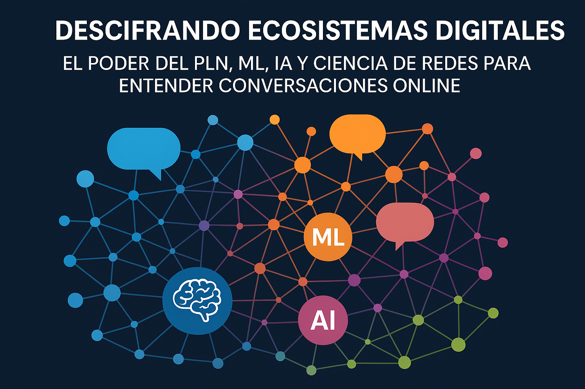

# Introducción

En el contexto de una Etnografía Digital, la comprensión de las conversaciones en entornos digitales constituye un pilar fundamental para decodificar las nuevas formas de interacción social, construcción de identidad y dinámica cultural. El Procesamiento de Lenguaje Natural (PLN), el Machine Learning (ML), la Inteligencia Artificial (IA) y la Ciencia de Redes ofrecen un arsenal de herramientas que permiten caracterizar estas conversaciones de manera escalable, rigurosa y profunda.

# Procesamiento de Lenguaje Natural (PLN)

El PLN permite traducir el lenguaje humano, en toda su riqueza y ambigüedad, a formatos que las máquinas pueden analizar. Dentro del ámbito etnográfico, el PLN posibilita:

  

    <h2 style="font-weight: bold; color: #0066cc;">Extracción de Temas</h2>
    
Identificación automática de tópicos de conversación emergentes o latentes mediante técnicas como LDA (Latent Dirichlet Allocation) o BERTopic.

  

  

    <h2 style="font-weight: bold; color: #cc0000;">Análisis de Sentimiento</h2>
    
Clasificación de las emociones subyacentes (positivas, negativas, neutrales) asociadas a diferentes temas o actores.

  

  

    <h2 style="font-weight: bold; color: #009933;">Detección de Entidades</h2>
    
Reconocimiento de nombres de marcas, lugares, personas y conceptos relevantes dentro de las conversaciones.

  

  

    <h2 style="font-weight: bold; color: #9900cc;">Caracterización Semántica</h2>
    
Uso de embeddings semánticos (por ejemplo, Word2Vec, BERT) para entender relaciones y matices entre conceptos.

  

# Machine Learning (ML)

El aprendizaje automático permite construir modelos predictivos y descriptivos a partir de grandes volúmenes de datos conversacionales. Su aplicación en la caracterización de conversaciones incluye:

- **Clustering Conversacional**: Agrupación de usuarios o conversaciones en "tribus" digitales, basadas en patrones de lenguaje, temas o comportamientos.

- **Clasificación Temática Supervisada**: Entrenamiento de modelos para etiquetar conversaciones específicas según categorías de interés etnográfico.

- **Modelado de Dinámicas Temporales**: Análisis de la evolución de las conversaciones a través del tiempo para identificar cambios en las narrativas o la aparición de fenómenos virales.

# Inteligencia Artificial (IA)

La IA, integrando PLN y ML, permite sistemas más complejos que no solo analizan, sino que también interpretan y generan nuevos conocimientos sobre las conversaciones. Entre las capacidades avanzadas relevantes destacan:

- **Análisis Contextual Profundo**: Interpretación de mensajes considerando contexto histórico, cultural y conversacional.

- **Detección de Narrativas Emergentes**: Identificación temprana de nuevas historias, valores y preocupaciones sociales reflejadas en las conversaciones.

- **Mapeo de Ecosistemas Digitales**: Construcción de mapas relacionales entre actores, discursos y plataformas.

# Ciencia de Redes

La Ciencia de Redes aporta una perspectiva estructural y relacional al análisis de conversaciones digitales, permitiendo visualizar y entender las interacciones como sistemas complejos. Entre sus principales aplicaciones destacan:

  

    <h2 style="font-weight: bold; color: #0066cc;">Análisis de Redes Sociales</h2>
    
Estudio de los vínculos entre participantes, identificando nodos clave, influenciadores y comunidades emergentes.

  

  

    <h2 style="font-weight: bold; color: #cc0000;">Modelado de Difusión</h2>
    
Comprensión de cómo las ideas, memes o narrativas se propagan a través de la red.

  

  

    <h2 style="font-weight: bold; color: #009933;">Puentes Sociales</h2>
    
Detección de usuarios o conversaciones que actúan como conectores entre distintas comunidades.

  

  

    <h2 style="font-weight: bold; color: #9900cc;">Métricas de Red</h2>
    
Cuantificación de la importancia estructural de actores y subgrupos en el ecosistema digital.

  

# Aplicaciones Prácticas en una Etnografía Digital

  

    <h2 style="font-weight: bold; color: #0066cc;">Identificación de comunidades digitales en el ecosistema educativo de Guadalajara</h2>
    
Análisis de cómo se forman y evolucionan los grupos de interés alrededor de Subiré y sus competidores clave como el Instituto de Ciencias, Thomas Jefferson School y The American School Foundation of Guadalajara.

  

  

    <h2 style="font-weight: bold; color: #cc0000;">Monitoreo de tendencias educativas</h2>
    
Observación de la emergencia de modas educativas, movimientos sociales relacionados con la educación o narrativas sobre innovación pedagógica en la Zona Metropolitana de Guadalajara.

  

  

    <h2 style="font-weight: bold; color: #009933;">Caracterización de la voz de padres y estudiantes</h2>
    
Comprensión de cómo distintos segmentos socioeconómicos (medio-alto y alto) expresan sus valores, necesidades y aspiraciones educativas en relación a Subiré y sus competidores.

  

  

    <h2 style="font-weight: bold; color: #9900cc;">Estudio de patrones discursivos en la comunidad educativa</h2>
    
Identificación de estructuras lingüísticas propias de las comunidades asociadas a cada institución educativa, revelando diferencias en cultura y valores.

  

  

    <h2 style="font-weight: bold; color: #0066cc;">Mapeo de redes de conversación en el sector educativo privado</h2>
    
Visualización de las conexiones entre usuarios, discursos y temas educativos, revelando arquitecturas de interacción entre las diferentes instituciones y sus comunidades en las plataformas digitales analizadas.

  

# Consideraciones Éticas

En el contexto del análisis del ecosistema educativo de la Zona Metropolitana de Guadalajara, el uso de tecnologías avanzadas como PLN, ML, IA y Ciencia de Redes requiere un manejo responsable y ético de la información. Esto incluye:

- Protección de la privacidad de estudiantes, padres y personal educativo
- Manejo cuidadoso de información sensible sobre instituciones educativas
- Consideración de sesgos potenciales en el análisis de diferentes segmentos socioeconómicos
- Representación equilibrada de todas las instituciones analizadas
- Transparencia en la metodología y limitaciones del análisis

# Conclusión

La combinación de PLN, ML, IA y Ciencia de Redes ha permitido obtener una visión profunda y matizada del posicionamiento de Subiré y sus competidores en el ecosistema educativo digital de Guadalajara. Este análisis revela patrones de interacción, percepciones y dinámicas comunitarias que son fundamentales para comprender:

- Las narrativas dominantes en torno a cada institución educativa
- Los factores que influyen en la elección escolar en segmentos medio-alto y alto
- La evolución de las conversaciones sobre innovación y calidad educativa
- Las oportunidades estratégicas para fortalecer el posicionamiento digital de Subiré

Este enfoque metodológico sienta las bases para una toma de decisiones estratégicas informada y basada en datos, mientras mantiene un compromiso con la ética y la responsabilidad en el análisis digital.
